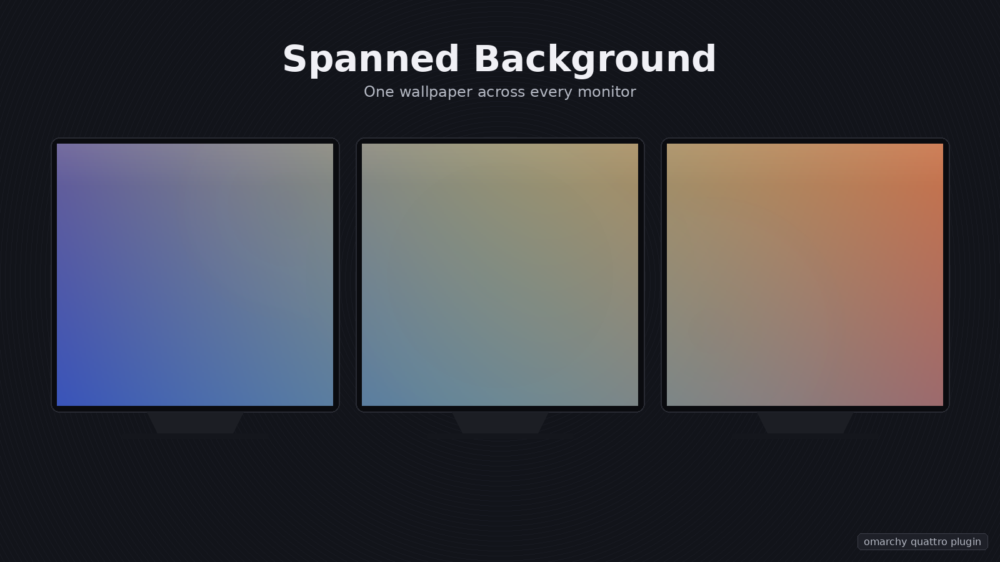

# Spanned Background



An [Omarchy](https://omarchy.org) **Quattro** shell plugin that treats all of
your monitors as one continuous canvas and paints a single wallpaper across
them — the equivalent of the Windows "Span" wallpaper fit. Edge to edge, no
bezel compensation: the pixel at the right edge of your left monitor is the
pixel immediately left of the one at the left edge of your right monitor.

It is a drop-in replacement for the built-in `omarchy.background` service, so
everything else keeps working: `omarchy-theme-bg-set`, the `Super + Ctrl + Space`
background picker, theme switching with its diagonal wipe, and double-clicking
the desktop.

## Requirements

- Omarchy 4.x ("Quattro"). This plugin targets the Quickshell-based
  `omarchy-shell` and does **not** work on Omarchy 3 or earlier.
- Two or more monitors, obviously. With a single monitor it behaves exactly like
  the stock background service.
- No external packages. It uses only what Omarchy already ships.

## Install

```bash
omarchy plugin disable omarchy.background
omarchy plugin add https://github.com/keasbeexd/omarchy-spanned-background --enable
```

Or manually, without git:

```bash
mkdir -p ~/.config/omarchy/plugins
cp -r omarchy-spanned-background ~/.config/omarchy/plugins/spanned-background
omarchy plugin validate ~/.config/omarchy/plugins/spanned-background
omarchy plugin disable omarchy.background
omarchy plugin enable keasbeexd.spanned-background
```

Disable the built-in *first* in both cases: while the two are enabled together
they fight over the same IPC target.

If the wallpaper does not change immediately, ask the shell to rescan:

```bash
omarchy-shell -q shell rescanPlugins
```

…and if that does not pick it up, restart the shell or log out and back in.

> [!IMPORTANT]
> **Disabling `omarchy.background` is required, not optional.** Both plugins draw
> on the Wayland background layer and both claim the `background` IPC target, so
> running them together gives you two stacked wallpapers and an IPC conflict.

## Using it

Spanning is on by default. To flip it at runtime:

```bash
omarchy-shell -q background span off      # back to one image per monitor
omarchy-shell -q background span on
omarchy-shell -q background span toggle
```

The choice is written to `~/.config/omarchy/spanned-background.conf` and read
back when the shell starts. You can also change the `spanEnabled` default at the
top of `SpannedBackground.qml`.

Everything else is unchanged:

| Action | Result |
| --- | --- |
| `Super + Ctrl + Space` | background picker |
| double-click the desktop | background picker |
| right-double-click the desktop | theme switcher |

## Removing

```bash
omarchy plugin disable keasbeexd.spanned-background
omarchy plugin enable omarchy.background
omarchy plugin remove keasbeexd.spanned-background     # if installed via git
```

`omarchy plugin remove` deletes the plugin directory and all bundled scripts.
It does **not** touch:

- `~/.config/omarchy/spanned-background.conf` — the one-line file holding
  `span=on` or `span=off`. Delete it manually if you want no trace.

Nothing else is left behind: no daemons, no systemd units, no udev rules, no
`sudoers` entries, no polkit actions, no cache directory, no state directory,
no keyring items, no packages installed, no shared configuration edited.

## How it works

The stock background service creates one background-layer window per screen and
fills each with `PreserveAspectCrop` — which is why every monitor gets its own
full copy of the image.

This plugin keeps the one-window-per-screen structure (that is how Wayland layer
shells work) but changes what each window draws. On startup, and whenever a
monitor is added, removed, moved, rotated or rescaled, it reads `x`, `y`, `width`
and `height` from every `ShellScreen`, computes the bounding box of the whole
virtual desktop, and sizes each window's image to *that* box, offset by the
negative of its own screen origin. Each output therefore renders only its slice
of one shared image, clipped to its own bounds. Every panel asks for the same
image at the same size, so Qt's pixmap cache holds a single decode between them
— the same memory profile as the stock plugin.

Because Hyprland lays every output out in a single logical coordinate space,
this is automatically correct for mixed resolutions, mixed (including
fractional) scale factors, portrait monitors and stacked arrangements — nothing
is hardcoded about any particular setup.

The theme-change wipe is computed in that same virtual space and then shifted
into each output's local coordinates, so one diagonal sweeps continuously across
the whole desktop instead of each screen wiping independently.

If the compositor ever returns geometry that does not make sense, the plugin
falls back to stock per-monitor rendering rather than drawing something wrong.

## Notes and caveats

- **Aspect ratio.** The image is scaled to cover the full virtual desktop and
  the overflow is cropped. Two 16:9 monitors side by side make a 32:9 canvas, so
  an ordinary 16:9 wallpaper loses roughly its top and bottom thirds.
  Ultrawide-sourced wallpapers look dramatically better. Nothing is ever
  stretched — aspect ratio is always preserved.
- **Non-rectangular layouts.** If your monitors are not aligned (say one sits
  200px lower than the other), the bounding box includes the empty L-shaped
  region. That area is simply not visible on any screen; the parts you can see
  still line up correctly.
- **Fractional scaling.** Alignment is computed in logical pixels, so on
  fractional scale factors the seam can land on a fractional device pixel. Any
  resulting misalignment is sub-pixel and not visible in practice.
- **Memory.** Spanning adds no decodes: every screen shares one cached decode
  of the image, exactly as the stock plugin does.

## What it does on your system

Omarchy plugins run unsandboxed inside the shell process, so here is the full
list of what this one touches. Every file read and every command invocation
routes through a bundled bash helper in `bin/`; the QML never issues a shell
string, and every helper is invoked by absolute path with its arguments as
separate argv elements.

- **Reads**, via `bin/resolve-bg`, the symlink Omarchy maintains at
  `~/.local/state/omarchy/current/background`. The helper caps `readlink`
  output at 4096 bytes, refuses anything that is not a regular file owned by
  the current user, and rejects paths with control characters before the
  result reaches the wallpaper renderer.
- **Reads**, via `bin/read-conf`, `~/.config/omarchy/spanned-background.conf`
  using `dd iflag=nofollow,nonblock,count_bytes` at most 129 bytes at a time,
  so a symlink or FIFO planted at that name is refused rather than followed
  or blocked on.
- **Writes**, via `bin/write-conf`, the same file. The write creates an
  unpredictable temporary via `mktemp` in the destination directory, chmods it
  600, writes the payload, and `mv -f -T`s it over the destination — so a
  planted symlink at the destination is *replaced* by `rename(2)` rather than
  truncating whatever it pointed at. The value on argv is validated against
  the closed set `{on, off}` before the helper touches the filesystem.
- **Runs**, only when you double-click the desktop, the same two commands the
  stock plugin runs: `omarchy-theme-bg-switcher` / `omarchy-theme-bg-set` and
  `omarchy-theme-switcher` / `omarchy-theme-set`. Each pair runs under
  `setsid -w timeout -k 2 60` in `bin/pick-bg` / `bin/pick-theme`, with a
  4 KiB output cap and control-character rejection on the picker's output
  before it becomes an argv element of the setter.
- Reads the wallpaper image itself. Every path that reaches `Image.source`
  is either produced by a helper above or arrives via IPC and is put through
  the same absolute-path + control-char + length check.
- **No network access, no elevated privileges, no external packages**, and
  nothing outside `~/.config/omarchy/spanned-background.conf` is ever written.

The `background` IPC surface exposes `refresh`, `set`, `setInstant`,
`transition`, `themeTransition` and `span`. Every string argument is capped,
control-character-rejected, and required to be an absolute path or `file://`
URL (`span` is further restricted to `on|off|toggle|true|false|1|0|""` and
capped at 32 bytes). `themeTransition`'s two base64 payloads are capped at
~96 KiB decoded before they reach the theme loader.

## Issues

Bug reports and pull requests are welcome at
<https://github.com/keasbeexd/omarchy-spanned-background/issues>. Please include
your monitor layout (`hyprctl monitors -j`) and your Omarchy version.

## License

MIT — see [LICENSE](LICENSE).
